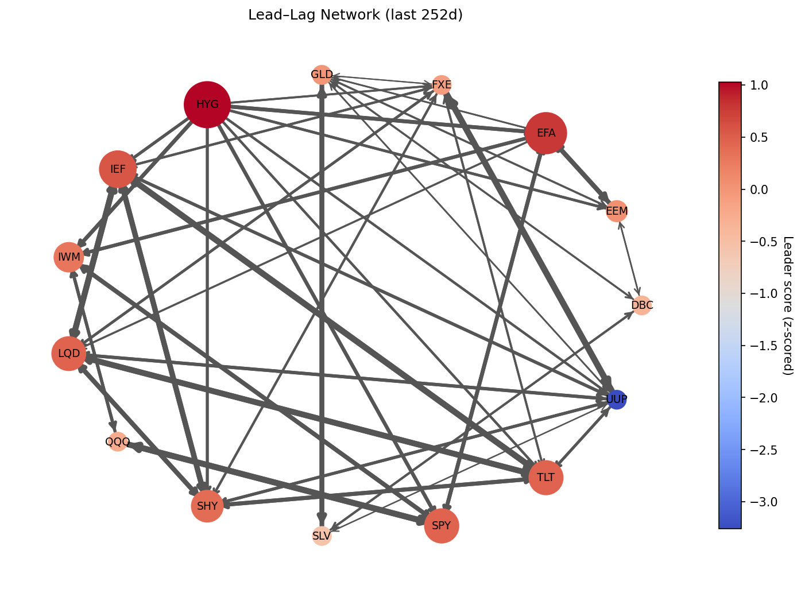
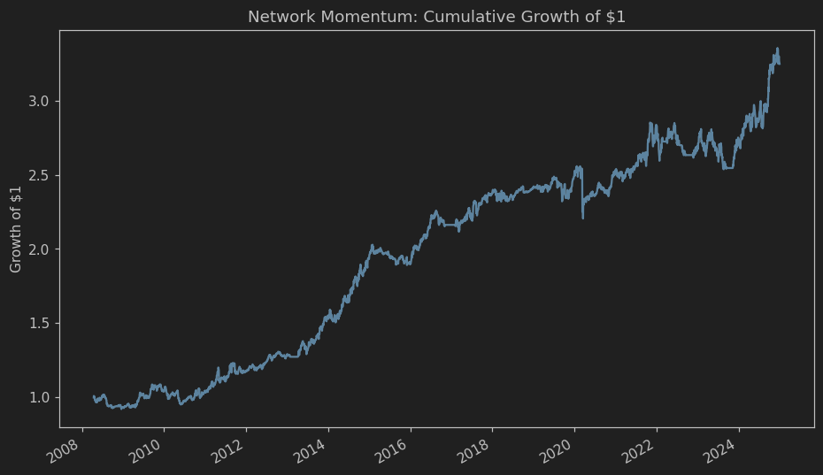

# Cross-Asset Lead–Lag Network

A lightweight research toolkit for discovering lead–lag relationships across asset returns, visualising the resulting
directed network, and driving a simple momentum-style portfolio strategy from those relationships.

The repository contains:

- `lead_lag_graph.py` — utilities to compute lagged correlations, build a directed adjacency matrix, and visualise the
  network.
- `trading_algo.py` — a reference backtest that uses the network to select leaders and allocate capital with risk
  targeting and optional regime filters.
- `example.ipynb` — an end-to-end example that downloads market data, builds the network, and runs the backtest.

### Visualisations and Results

The figures below are generated with the helper script in `scripts/generate_artifacts.py` (see "Re-generate visuals and
stats" for details). If the images don’t render yet, run the script to create them under `assets/` and commit the
outputs.





The results are summarised in the table below.

| Metric      | Value                |
|-------------|----------------------|
| CAGR        | 0.05070218789261105  |
| AnnVol      | 0.09305721051394995  |
| Sharpe      | 0.5314869289150495   |
| MaxDrawdown | -0.14665971695554614 |
| NumTrades   | 844                  |
| Start       | 2008-04-15 00:00:00  |
| End         | 2024-12-31 00:00:00  |

## Motivation

Traditional momentum or correlation models often ignore directional, lagged influence between assets. This repository
explores whether identifying “leaders” in a directed, lagged-correlation network can improve allocation timing and
selection.

## Methodology (High level)

- Compute pairwise correlations across lags in `[-max_lag, max_lag]`, keeping the lag with the highest absolute
  correlation.
- Build a signed, directed adjacency matrix: if asset `i` tends to precede `j` at the best lag, create edge `i → j` with
  weight equal to the signed correlation.
- Score nodes (assets) by leader strength (e.g., signed out-strength, absolute out-strength, or PageRank variants).
- Optionally filter edges per node (top-k) to sparsify the graph.
- Combine leadership with simple momentum/regime gates (e.g., SMA, MA cross); scale portfolio to a target volatility
  with rolling covariance and optional shrinkage.

## Features

- Estimate best lag per pair and build a signed, directed adjacency matrix.
- Visualise the network (NetworkX/Matplotlib) with edge pruning and several node scoring options.
- Backtest a “network momentum” strategy:
    - Leader selection from graph metrics (e.g., out-strength, abs out-strength, PageRank variants).
    - Momentum/regime gates (price SMA, MA cross, etc.).
    - Volatility targeting with optional shrinkage.
    - Weekly/monthly rebalancing and simple transaction cost model.
- Optional Numba-accelerated adjacency construction (`build_adj_fast`).

## Getting Started

### Requirements

- Python 3.10+
- numpy, pandas, matplotlib, networkx
- yfinance (for data in the example)
- numba (optional; used by `build_adj_fast`)

Install with pip:

```bash
pip install -r requirements.txt
```

Or create a conda environment:

```bash
conda env create -f environment.yml
conda activate leadlag-net
```

### Quickstart (Jupyter)

Open `example.ipynb` and run all cells. It will:

1. Download daily close prices for a basket of ETFs (via yfinance).
2. Compute daily log returns.
3. Build a lead–lag adjacency matrix for the last 252 trading days.
4. Visualise the network and list top “leaders”.
5. Run the network momentum backtest and plot cumulative performance.

> Tip: To save the network plot, add `plt.savefig("leadlag_network.png", bbox_inches="tight", dpi=150)` right after
> calling `leadlag_graph(...)`. To save cumulative return chart, call
`plt.savefig("cum_returns.png", bbox_inches="tight", dpi=150)` after plotting.

### Quickstart (Python script)

```python
import numpy as np
import pandas as pd
import yfinance as yf
from lead_lag_graph import build_adj, leadlag_graph
from trading_algo import backtest_network_momentum
import matplotlib.pyplot as plt

# 1) Data
tickers = [
    'SPY', 'QQQ', 'IWM', 'EFA', 'EEM', 'TLT', 'IEF', 'SHY', 'LQD', 'HYG', 'GLD', 'SLV', 'DBC', 'UUP', 'FXE'
]
prices = yf.download(tickers, start='2007-01-01', end='2025-01-01')['Close'].dropna()
returns = np.log(prices / prices.shift(1)).dropna()

# 2) Network
A = build_adj(returns.tail(252), max_lag=5, min_abs_corr=0.15)
H, z = leadlag_graph(
    A,
    title='Lead–Lag Network (last 252d)',
    max_edges=80,
    node_score='out_strength',
    layout='circular',
    seed=42,
    visualise=True,
)
print(z.sort_values(ascending=False).head(10))
# Save the figure if running non-interactively
plt.savefig("leadlag_network.png", bbox_inches="tight", dpi=150)

# 3) Backtest
port_rets, metrics, w_hist = backtest_network_momentum(
    prices, returns,
    leader_method="abs_out_strength",
    max_lag=5, min_abs_corr=0.15,
    sparsify_topk=3,
    regime="ma_cross", fast_ma=50, slow_ma=200,
    ema_span=15,
    target_ann_vol=0.10, cov_win=60, shrink_lambda=0.1,
    rebalance="W-FRI",
    use_numba=True
)
print(metrics)

# 4) Plot and save cumulative performance
cum = port_rets.cumsum().apply(np.exp)
ax = cum.plot(title='Network Momentum: Cumulative Growth of $1')
ax.set_ylabel('Growth of $1')
plt.savefig("cum_returns.png", bbox_inches="tight", dpi=150)
```

## Results

Run either Quickstart to produce two main visuals:

- Lead–lag network graph (`leadlag_network.png`): nodes are assets; directed edges follow the detected lead
  relationship; edge colour/width reflect correlation sign/magnitude. Useful for seeing clusters and dominant leaders.
- Cumulative return chart (`cum_returns.png`): exponential of cumulative log-returns of the backtested strategy. This
  gives the growth of $1 over time.

## Limitations

- Lagged correlations can be unstable and regime-dependent; edges may flip over time.
- Simple correlation ignores nonlinear/lead-lag structures beyond Pearson relationships.
- Backtest is illustrative: no slippage model beyond simple bps costs; ignores taxes, borrow constraints, etc.
- Universe choice and `min_abs_corr` threshold materially affect results.

## API Overview

Below is a brief overview of the most useful functions. Inspect the source files for full details.

### Module: `lead_lag_graph.py`

- `corr_at_lag(x: pd.Series, y: pd.Series, lag: int) -> float`
    - Pearson correlation between two series at a given (positive/negative) lag. Returns `NaN` if too few overlapping
      points.

- `best_lag_corr(x: pd.Series, y: pd.Series, max_lag: int = 5) -> dict`
    - Searches lags in `[-max_lag, max_lag]` and returns `{"lag": int, "corr": float}` with the highest absolute
      correlation.

- `build_adj(returns: pd.DataFrame, max_lag: int = 5, min_abs_corr: float = 0.15) -> pd.DataFrame`
    - Constructs a directed adjacency matrix A (index/columns = tickers). If lag>0, i leads j (edge i→j). Only keeps
      |corr| ≥ threshold.

-

`leadlag_graph(A: pd.DataFrame, title="lead-lag network", max_edges: int = 80, node_score: str = "out_strength", layout: str = "circular", seed: int = 42, visualise: bool = True)`

- Builds a NetworkX `DiGraph` from A, optionally visualises it, and computes per-node leader z-scores. Supported
  `node_score` values include:
- `out_strength` (row sum), `abs_out_strength`, `pos_only`, `pagerank`, `sign_aware_pagerank`.
- Returns `(G, z_scores)`.

- `build_adj_fast(returns: pd.DataFrame, max_lag: int = 5, min_abs_corr: float = 0.15) -> pd.DataFrame`
    - Optional Numba-accelerated adjacency builder with the same interface as `build_adj`.

### Module: `trading_algo.py`

- `leader_scores(A: pd.DataFrame, method: str = "out_strength", pagerank_alpha: float = 0.9) -> pd.Series`
    - Compute leader z-scores from adjacency `A`. Methods: `out_strength`, `abs_out_strength`, `pos_only`, `pagerank`,
      `sign_aware_pagerank`.

- `backtest_network_momentum(
    prices: pd.DataFrame,
    returns: pd.DataFrame,
    window: int = 252,
    max_lag: int = 5,
    min_abs_corr: float = 0.15,
    rebalance: str = "M",
    mom_lookback: int = 50,
    ema_span: int | None = 20,
    target_ann_vol: float | None = 0.10,
    tc_bps: float = 3.0,
    cov_win: int = 60,
    leader_method: str = "out_strength",
    pagerank_alpha: float = 0.9,
    sparsify_topk: int | None = None,
    regime: str = "price_sma",  # alternatives: "ma_cross", "ma50_rising"
    fast_ma: int = 50,
    slow_ma: int = 200,
    slope_win: int = 10,
    shrink_lambda: float | None = None,
    use_numba: bool = False
  ) -> tuple[pd.Series, dict, pd.DataFrame]`
    - Sliding-window workflow:
        1) Build adjacency on rolling window of returns (fast path optional).
        2) Rank leaders; optionally sparsify to top-k outgoing edges.
        3) Combine leadership with momentum/regime gates.
        4) Scale to target volatility using rolling covariance and optional shrinkage.
        5) Apply simple transaction costs; rebalance at specified frequency.
    - Returns: `(portfolio_returns, summary_metrics, weight_history)`.

Other helpers of note:

- `sparsify_topk_outgoing(A, k)` — keep only top-k outgoing edges per node.
- Regime/momentum helpers: `momentum_gate_binary`, `momentum_signal_continuous`, `ma_cross_regime_gate`,
  `ma50_rising_gate`, `ma_strength_continuous`.

## Tips and Notes

- Data frequency: examples use daily closes; the code should work for any equally spaced series.
- Stability: lagged correlations can be noisy; consider increasing `min_abs_corr`, lowering `max_lag`, or applying
  `sparsify_topk`.
- Performance:
    - Use `build_adj_fast(..., use_numba=True)` in the backtest or call `build_adj_fast` directly if Numba is installed.
    - Limit the universe size or max lag when prototyping.
- Rebalancing: pass pandas offset aliases like `"M"`, `"W-FRI"`, etc.

## Troubleshooting

- Empty or sparse network:
    - Lower `min_abs_corr`, widen the window, or broaden the universe.
- Numerical issues (NaNs/Infs):
    - Ensure `returns` has no constant columns; drop assets with too little data.
- Slow runs:
    - Reduce `max_lag`, universe size, or enable Numba acceleration.
- yfinance throttling/errors:
    - Cache data locally or provide your own `prices`/`returns` instead of downloading each run.

## Disclaimer

This repository is for research and educational purposes only. It is not investment advice. Past performance does not
guarantee future results.

## Licence

This project is licensed under the MIT License. See the `LICENSE` file for details.
